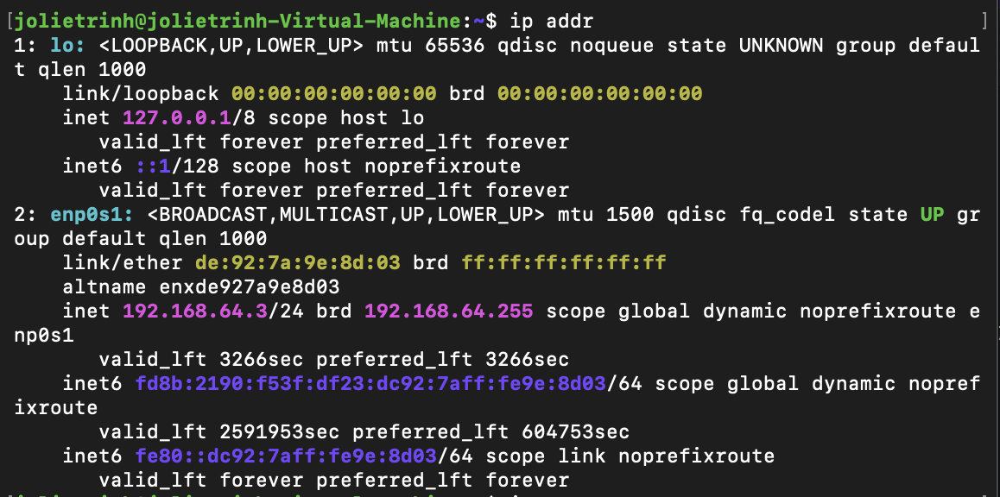
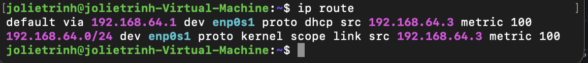
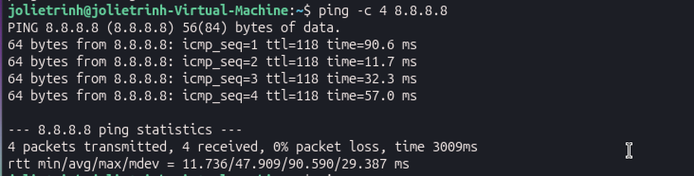
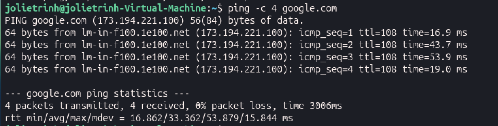
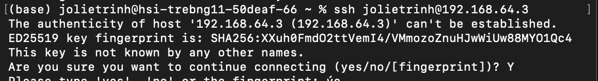
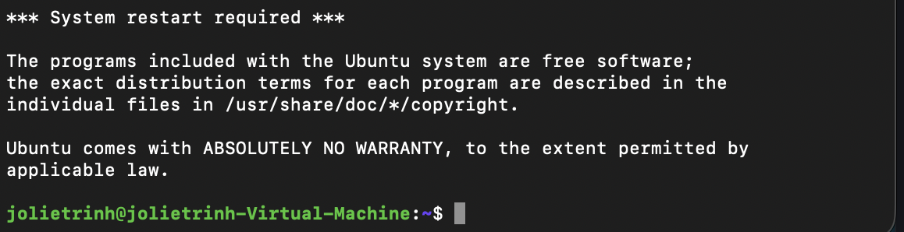
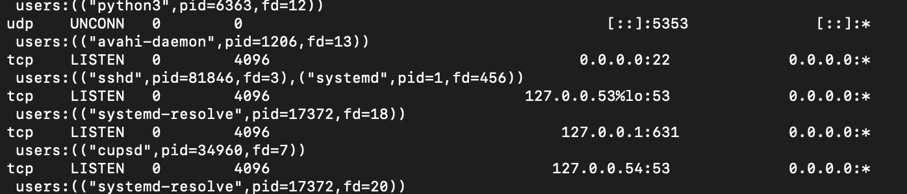
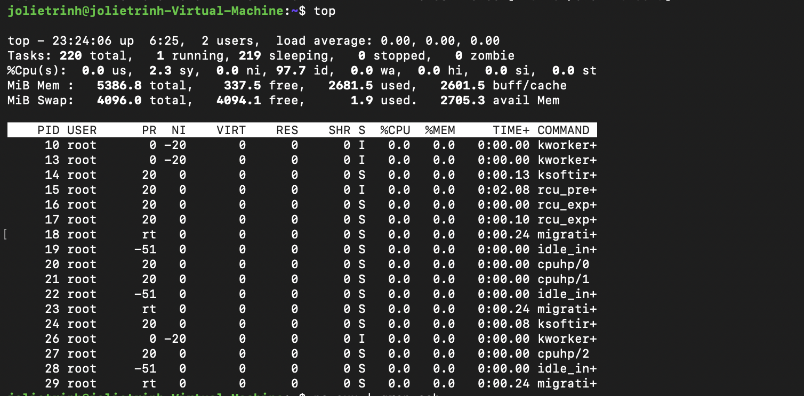
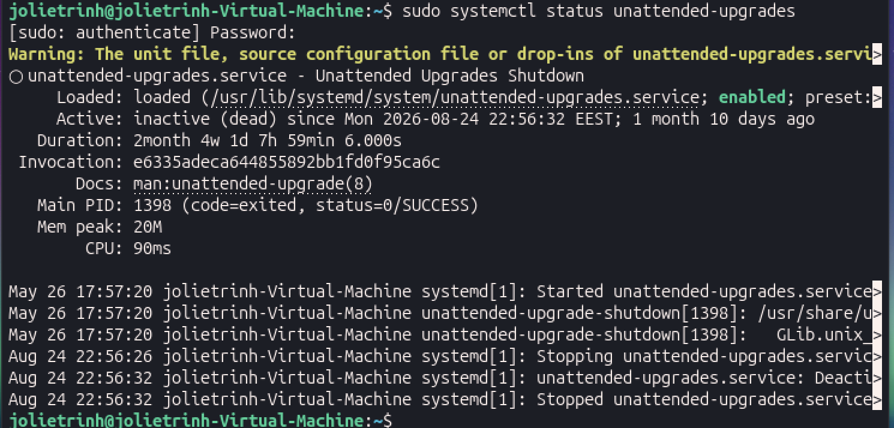

# Linux & Virtualization Lab

A hands-on Linux lab built with Ubuntu and VirtualBox to practice basic system administration, networking, SSH access and troubleshooting.

## Environment

* Ubuntu Linux
* VirtualBox
* macOS host
* SSH
* Linux networking tools

## What I practiced

* Setting up and using an Ubuntu virtual machine
* Basic Linux command-line administration
* SSH-based remote access
* Inspecting network interfaces and IP addresses
* Checking routing tables and default gateways
* Testing network connectivity and DNS resolution
* Inspecting running processes and system resources
* Checking listening network ports
* Troubleshooting basic system and network issues

---

## System & Network Inspection

### Checking network interfaces

I used `ip -br addr` to get a compact overview of the network interfaces and assigned IP addresses.

```bash
ip -br addr
```



This helped me identify the active interfaces, their state and the IP addresses assigned to the Ubuntu VM.

### Checking the routing table

```bash
ip route
```



The routing table shows how the system decides where to send traffic. I specifically checked the default route and the interface used for it.

### Testing connectivity

I used `ping` to test both IP connectivity and DNS resolution:

```bash
ping -c 4 8.8.8.8
ping -c 4 google.com
```



Testing an IP address and a hostname separately helped me distinguish basic network connectivity problems from possible DNS resolution problems.

---

## SSH Access

I configured SSH on the Ubuntu VM and connected to it remotely from my macOS host.

```bash
sudo apt install openssh-server
sudo systemctl status ssh
```

After configuring the VirtualBox network, I connected from macOS using:

```bash
ssh <username>@<vm-ip>
```



This gave me hands-on practice with remote Linux administration through SSH.

### Checking the SSH listening port

```bash
sudo ss -tulpn
```



The SSH service was listening on TCP port 22 (ssh) 

---

## Processes & System Resources

I also practiced basic process and resource inspection.

```bash
ps aux
top
free -h
df -h
```

These commands helped me inspect running processes, memory usage and disk usage from the command line.



---

# 🛠️ Real-World Troubleshooting & Diagnostics

I encountered and investigated several configuration issues while setting up the environment.

Rather than simply restarting the VM or reinstalling software, I used Linux diagnostic commands to identify the causes and verify the fixes.

## 1. Incorrect system time causing `apt update` failure

### Issue

Running:

```bash
sudo apt update
```

returned errors similar to:

```text
Release file ... is not valid yet
(invalid for another 40d ...)
```

### Investigation

I checked the system date and time:

```bash
date
timedatectl
```

The VM's system clock was not synchronized correctly.

### Cause

The package manager validates repository metadata using timestamps. Because the VM's clock was incorrect, Ubuntu considered the repository metadata to be dated in the future.

### Resolution

I corrected the VM's time synchronization and verified the system clock before running:

```bash
sudo apt update
```

### What I learned

This showed me that basic system configuration such as time synchronization can affect package management and system administration tasks.

---
## 2. `unattended-upgrades` Service Not Working as Expected

### Issue

While checking the automatic update service, I ran:

```bash
sudo systemctl status unattended-upgrades
```

The service was not operating as expected.




### Resolution

I restarted the service:

```bash
sudo systemctl restart unattended-upgrades
```

Then checked its status again:

```bash
sudo systemctl status unattended-upgrades
```

### What I learned

I practiced using `systemctl` to inspect and restart Linux services instead of treating a service failure as an unexplained error

